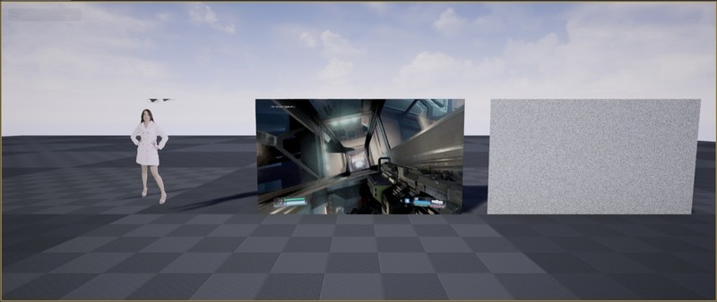

# UE4 GStreamer plugin

## Getting Started

Tested with UE4 4.26 and GStreamer 1.18.4

Download and install [GStreamer runtime and development packages](https://gstreamer.freedesktop.org/download/)

Edit `Plugins\GStreamer\Source\GStreamer\GStreamer.Build.cs`

Modify `const string GStreamerRoot = @"C:\dev\gstreamer_dev\1.0\msvc_x86_64"` to path where development package installed

Launch project and hit play

## Example pipelines

Test pattern:
`videotestsrc pattern=snow ! video/x-raw,width=(int)512,height=(int)512,format=(string)RGBA,framerate=(fraction)30/1 ! appsink name=sink`

Play a local file:
`filesrc location=d:/video/doom.mp4 ! decodebin ! videoconvert ! video/x-raw,format=(string)RGBA ! videoconvert ! appsink name=sink`

Play URI:
`uridecodebin uri=http://images.nvidia.com/geforce-com/international/videos/doom/doom-nvidia-geforce-gtx-geforce-dot-com-vulkan-graphics-api-gameplay-video.mp4 ! videoconvert ! video/x-raw,format=(string)RGBA ! videoconvert ! appsink name=sink`
